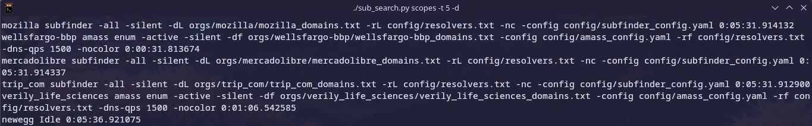
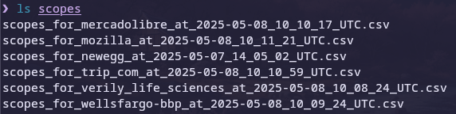
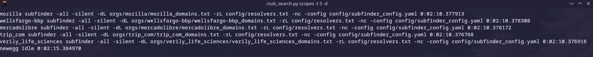
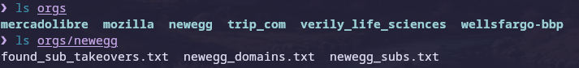
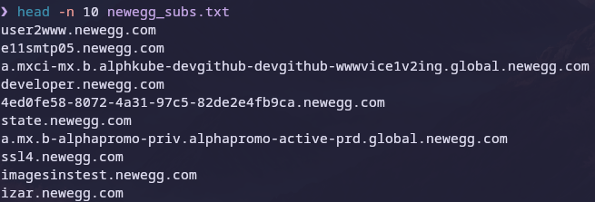

# python_recon
This is a personal program that I wrote to automate recon for bug bounty. It cycles through subfinder, amass and nuclei to find subdomains and takeovers. It is also possible to add additional commands.



## Usage
```nroff
positional arguments:
  dir                   The path to scope files from HackerOne

options:
  -h, --help            show this help message and exit
  -t, --max-threads MAX_THREADS
                        Max thread count
  -d, --debug
```
The ```max-threads``` flag determines how many targets to scan at once. 

## Setup

Add the CSV scope files of programs from HackerOne to the scopes dir.



Add config files to the config dir.


Good luck :)

```
./sub_search.py scopes -t 5 -d
```



## Results
An orgs dir is created for saving results.






